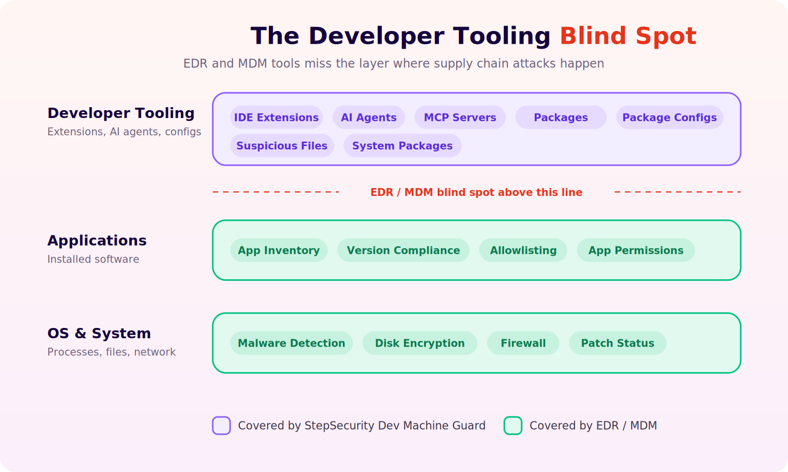
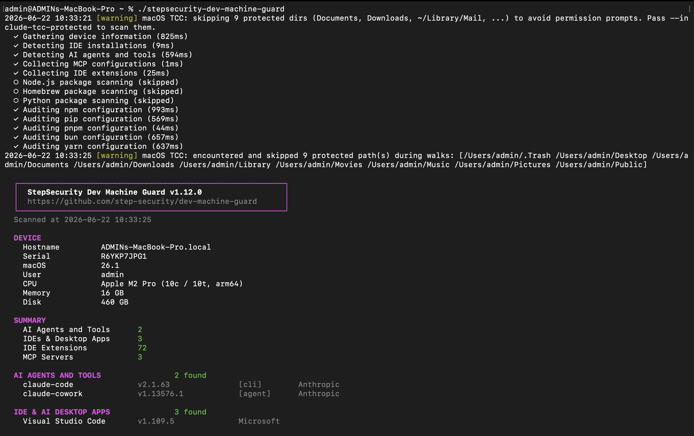
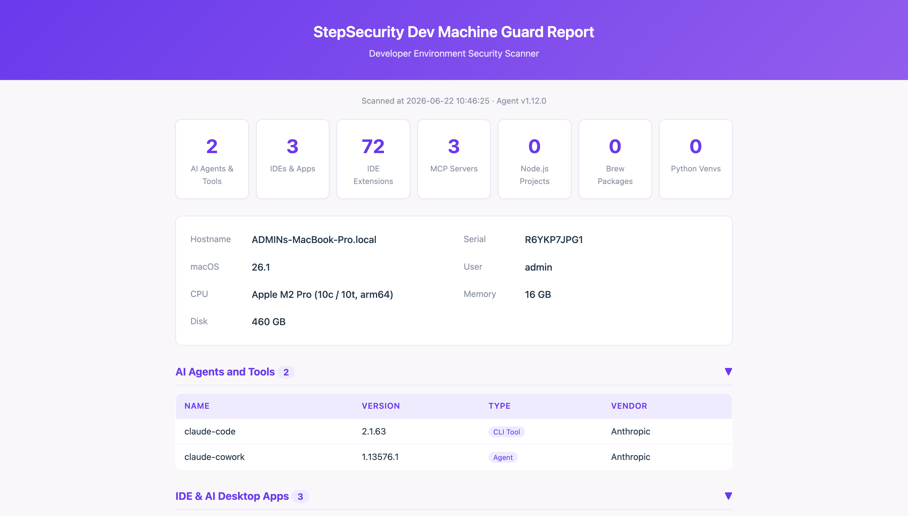

<h1 align="center">StepSecurity Dev Machine Guard</h1>

<p align="center">
  
</p>

<p align="center">
  
</p>

<p align="center">
  <a href="https://github.com/step-security/dev-machine-guard/actions/workflows/shellcheck.yml"></a>
  <a href="LICENSE"></a>
  <a href="https://github.com/step-security/dev-machine-guard/releases"></a>
</p>

<p align="center">
  <b>Scan your dev machine for AI agents, MCP servers, IDE extensions, and suspicious packages — in seconds.</b>
</p>

## Why Dev Machine Guard?

Developer machines are the new attack surface. They hold high-value assets — GitHub tokens, cloud credentials, SSH keys — and routinely execute untrusted code through dependencies and AI-powered tools. Recent supply chain attacks have shown that malicious VS Code extensions can steal credentials, rogue MCP servers can access your codebase, and compromised npm packages can exfiltrate secrets.

<p align="center">
  
</p>


**EDR and traditional MDM solutions** monitor device posture and compliance, but they have **zero visibility** into the developer tooling layer:

| Capability                        | EDR / MDM | Dev Machine Guard |
|-----------------------------------|:---------:|:-----------------:|
| IDE extension audit               |           |        Yes        |
| AI agent & tool inventory         |           |        Yes        |
| MCP server config audit           |           |        Yes        |
| Node.js package scanning          |           |        Yes        |
| Device posture & compliance       |    Yes    |                   |
| Malware / virus detection         |    Yes    |                   |

**Dev Machine Guard is complementary to EDR/MDM — not a replacement.** Deploy it alongside your existing tools via MDM (Jamf, Kandji, Intune) or run it standalone.

<p align="center">
  
</p>

## Quick Start

```bash
# Clone the repository
git clone https://github.com/step-security/dev-machine-guard.git
cd dev-machine-guard

# Make the script executable
chmod +x stepsecurity-dev-machine-guard.sh

# Run the scan
./stepsecurity-dev-machine-guard.sh
```

Or run directly without cloning:

```bash
curl -sSL https://raw.githubusercontent.com/step-security/dev-machine-guard/main/stepsecurity-dev-machine-guard.sh -o stepsecurity-dev-machine-guard.sh
chmod +x stepsecurity-dev-machine-guard.sh
./stepsecurity-dev-machine-guard.sh
```

## What It Detects

See [SCAN_COVERAGE.md](SCAN_COVERAGE.md) for the full catalog of supported detections.

| Category              | Examples                                              |
|-----------------------|-------------------------------------------------------|
| IDEs & Desktop Apps   | VS Code, Cursor, Windsurf, Zed, Claude, Copilot      |
| AI CLI Tools          | Claude Code, Codex, Gemini CLI, Kiro, Aider           |
| AI Agents             | Claude Cowork, OpenClaw, GPT-Engineer                 |
| AI Frameworks         | Ollama, LM Studio, LocalAI                            |
| MCP Server Configs    | Claude Desktop, Cursor, Windsurf, Zed, Codex          |
| IDE Extensions        | VS Code, Cursor                                       |
| Node.js Packages      | npm, yarn, pnpm, bun (opt-in)                         |

## Output Formats

### Pretty Terminal Output (default)

```bash
./stepsecurity-dev-machine-guard.sh
```

<p align="center">
  
</p>

### JSON Output

```bash
./stepsecurity-dev-machine-guard.sh --json
./stepsecurity-dev-machine-guard.sh --json | python3 -m json.tool  # formatted
./stepsecurity-dev-machine-guard.sh --json > scan.json              # to file
```

### HTML Report

```bash
./stepsecurity-dev-machine-guard.sh --html report.html
```

<p align="center">
  
</p>

### Additional Options

```bash
./stepsecurity-dev-machine-guard.sh --verbose                 # Show progress messages
./stepsecurity-dev-machine-guard.sh --enable-npm-scan --json  # Include npm packages
./stepsecurity-dev-machine-guard.sh --help                    # Full usage
```

## Community vs Enterprise

| Feature                         | Community (Free)    | Enterprise                  |
|---------------------------------|:-------------------:|:---------------------------:|
| AI agent & tool inventory       |         Yes         |            Yes              |
| IDE extension scanning          |         Yes         |            Yes              |
| MCP server config audit         |         Yes         |            Yes              |
| Pretty / JSON / HTML output     |         Yes         |            Yes              |
| Node.js package scanning        |       Opt-in        |        Default on           |
| Centralized dashboard           |                     |            Yes              |
| Policy enforcement & alerting   |                     |            Yes              |
| Scheduled scans via launchd     |                     |            Yes              |
| Historical trends & reporting   |                     |            Yes              |

Enterprise mode requires a StepSecurity subscription. [Start a 14-day free trial](https://www.stepsecurity.io/start-free) by installing the StepSecurity GitHub App.

**Open-source commitment:** StepSecurity enterprise customers use the exact same script from this repository. There is no separate closed-source version — all scanning capabilities are developed and maintained here in the open. Enterprise mode adds centralized infrastructure (dashboard, policy engine, alerting) on top of the same open-source scanning engine.

## How It Works

<p align="center">
  
</p>

Dev Machine Guard is a lightweight bash script that scans your developer environment. Here's what it does and — importantly — what it does **not** do:

**What it collects:**
- Installed IDEs, AI tools, and their versions
- IDE extension names, publishers, and versions
- MCP server configuration (server names and commands only)
- Node.js package listings (opt-in)

**What it does NOT collect:**
- Source code, file contents, or project data
- Secrets, credentials, API keys, or tokens
- Browsing history or personal files
- Any data from your IDE workspaces

**In community mode**, all data stays on your machine. Nothing is sent anywhere.

**In enterprise mode**, scan data is sent to the StepSecurity backend for centralized visibility. The script source code is fully open — you can audit exactly what is collected and transmitted.

## Why a Shell Script?

Dev Machine Guard is intentionally implemented as a single bash script rather than a compiled binary in Go, Python, or another language. There are two key reasons:

1. **Zero-dependency deployment.** A shell script runs natively on macOS with no runtime, interpreter, or package manager required. This makes deployment across hundreds or thousands of developer machines via MDM (Jamf, Kandji, Intune) straightforward — push the script and it just works.

2. **Full transparency.** Developer machines are highly privileged environments with access to source code, credentials, and cloud infrastructure. A compiled binary is opaque — customers have to trust what it does. A readable shell script lets security teams review exactly what runs on their machines, line by line, before deploying it. No hidden telemetry, no opaque logic, no blind trust required.

## How It Compares

Dev Machine Guard is **not a replacement** for dependency scanners, vulnerability databases, or endpoint security tools. It covers a different layer — the developer tooling surface — that these tools were never designed to inspect.

| Tool Category | What It Does Well | What It Misses |
|---|---|---|
| **`npm audit` / `yarn audit`** | Flags known CVEs in declared dependencies | Has no visibility into IDEs, AI tools, MCP servers, or IDE extensions |
| **OWASP Dep-Check / Snyk / Socket** | Deep dependency vulnerability and supply-chain risk analysis | Does not scan the broader developer tooling layer (AI agents, IDE extensions, MCP configs) |
| **EDR / MDM (CrowdStrike, Jamf, Intune)** | Device posture, compliance, and malware detection | Zero visibility into developer-specific tooling like IDE extensions, MCP servers, or AI agent configurations |

Dev Machine Guard fills the gap by inventorying what is actually running in your developer environment. Deploy it alongside your existing security stack for complete coverage.

## Known Limitations

- **macOS only** (for now). Windows support is on the roadmap.
- **Node.js package scanning** is opt-in and results are basic (package manager detection and project count). Full dependency tree analysis is available in enterprise mode.
- **MCP config auditing** shows which tools have MCP configs (source, vendor, and config path) but does not display config file contents in community mode. Enterprise mode sends filtered config data (server names and commands only, no secrets) to the dashboard.

## Roadmap

Check out the [GitHub Issues](https://github.com/step-security/dev-machine-guard/issues) for planned features and improvements. Feedback and suggestions are welcome — open an issue to start a conversation.

## JSON Schema

See [examples/sample-output.json](examples/sample-output.json) for a complete sample of the JSON output, or [Reading Scan Results](docs/reading-scan-results.md) for the full schema reference.

## Contributing

We welcome contributions! Whether it's adding detection for a new AI tool, improving documentation, or reporting bugs.

See [CONTRIBUTING.md](CONTRIBUTING.md) for guidelines.

**Quick contribution ideas:**
- Add a new AI tool or IDE to the detection list
- Improve [documentation](docs/)
- Report bugs or request features via [issues](https://github.com/step-security/dev-machine-guard/issues)

## Resources

- [Changelog](CHANGELOG.md)
- [Scan Coverage](SCAN_COVERAGE.md) — full catalog of detections
- [Release Process](docs/release-process.md) — how releases are signed and verified
- [Versioning](VERSIONING.md) — why the version starts at 1.8.1
- [Security Policy](SECURITY.md) — reporting vulnerabilities
- [Code of Conduct](CODE_OF_CONDUCT.md)

## License

This project is licensed under the [Apache License 2.0](LICENSE).

---

If you find Dev Machine Guard useful, please consider giving it a star. It helps others discover the project.
